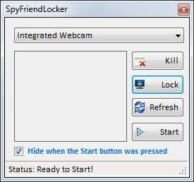
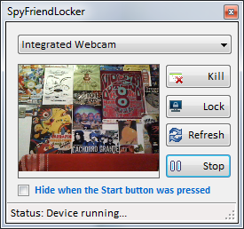

# SpyFriendLocker

## Description
Are you tired of the funny people messing with your computer? Would you like to know who did it?
With this tool you will be immune to these jokes when you leave the front of your screen.
SpyFriendLocker (Portable) is able to monitor via webcam who tries to use your system.
The software, from the moment it is activated, captures sequential images - with date and time - and saves to a directory that can be pre-configured; the user can still define some processes that, when opened,
automatically terminate by locking the system.

## Pre-requisites
- .NET Framework 4.0 (or above)
- Webcam (Integrated or USB)

## Download
- Initial version: [1.0.0](https://github.com/uknbr/SpyFriendLocker/releases/download/1.0.0/Spy_v1.0.ukN.BR.zip)
- Support new image formats: [1.1.0](https://github.com/uknbr/SpyFriendLocker/releases/download/1.1.0/Spy_v1.1.ukN.BR.zip)
- Configuration section: **soon**

## Configuration
- The **proc.dat** file contains the processes that will be checked and closed, if opened. Just add or remove the process name you want.
- The **config.ini** file has two fields for configuration.
  1. Path: Location where the captured images will be saved.
  2. Time: Process Verification Time (ms)

## Screeshots

\

